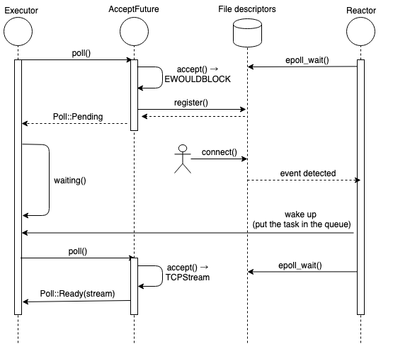

async/await echo server example
===============================
async/await echo server + α in rust.

- [Echo server](./src/echo.rs): This uses blocking socket I/O and handles only one connection at a time.
- [Multi-threaded echo server](./src/thread_echo.rs): This is almost same as the blocking one except that it spawn a thread for a each connection to handle multiple connections.
- [Epoll echo server](./src/epoll_echo.rs) : This uses epoll to handle multiple connections in one thread.
- [Async/await echo server](./src/aa_echo.rs) : Epoll echo server using async/await syntax. I use the same strategy as the [async-book](https://rust-lang.github.io/async-book/02_execution/03_wakeups.html) to spawn and execute futures. There is a dedicated thread to perform `epoll_wait()`, which is the same as the [async-std](https://github.com/async-rs/async-std/blob/master/src/net/driver/mod.rs).

Linux only. Just for learning purposes.

## Architecture
The below figure shows the sequence of accept in async/await echo server.

## How to test
1. Run a server
    - e.g., `cargo run --bin aa_echo`
2. Connect to the server in other terminal
    - e.g., `nc 127.0.0.1 8080` and then type something

## References
- [async-book](https://rust-lang.github.io/async-book)

## License
[CC0](https://creativecommons.org/choose/zero/)
